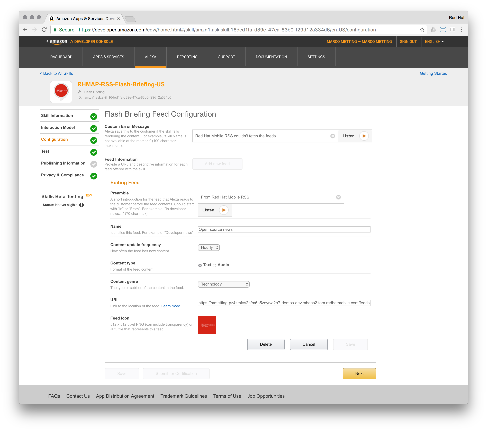

# Building an Alexa skill with Red Hat Mobile Application Platform - Part I

Amazon's Alexa enabled devices, such as the Echo, Dot and most recently Tap provide a hands-free voice controlled environment, to make calls, send and receive messages, provide information and more — instantly. Alexa is the cloud-based voice service that powers this category of devices. All the user has to do is ask Alexa to perform an action.

In 2015, Amazon launched the [Alexa Skill SDK (ASK)](http://phx.corporate-ir.net/phoenix.zhtml?c=176060&p=irol-newsArticle&ID=2062551) to open their cloud-based voice service to the developer community. 

With some lines of code, developers are now able to integrate existing web services into an Alexa skill. The end-user can voice control and interact with the skill, the speech recognition or natural language understanding is handled by Amazon.

Skills come in different flavours:

1. Flash Briefing: These skills provide original content for users’ flash briefings.
2. Smart Home: With these skills, users can control cloud-enabled smart-home devices like lights and thermostats.
3. Custom: These skills can handle just about any type of request. 

By implementing skills for Alexa, developers create a new channel towards their web services and the information on the internet. The ease of consumption for the user is the major benefit in environments, where hands-free interactions or mobile (meaning on-the-go) are key.

## Introduction

In this article series we'll leverage ASK to build Alexa skills providing news towards the end-user. Amazon's voice service will interact with a web service hosted in the Red Hat Mobile Application Platform (RHMAP) to pull RSS feeds from the internet:

- Part I: Starting with a Flash Briefing Skill
- Part II: Upgrading to a Custom Skill
- Part III: Host your own web service / Skill with Red Hat Mobile Application Platform

At the same time, the consumption of the news could also be leveraged in a mobile app or website.

[Red Hat Mobile Application Platform](https://www.redhat.com/en/technologies/mobile/application-platform) enables you to develop and deploy mobile apps in an agile and flexible manner. Take advantage of open technologies and standard toolkits while centralizing control over security, back-end integrations, and policy management.

This article is based on the following [sample projekt](https://github.com/mmetting/RHMAP-RSS-Reader-Demo) build with RHMAP.

In the left column, you can see the client app, which consumes the API provided by the Cloud Application (middle column). The Cloud Application enables developers to implement business logic on the server side and call out to back-end systems. Those back-ends are attached to the platform via the MBaaS Services (right column). MBaaS Services could be considered as reusable connectors, providing multiple projects / solutions on top of the platform reusable integration points towards the back-ends.

## Part I: Starting with a Flash Briefing Skill

The Flash Briefing Skill API defines the words users say to invoke the flash briefing or news request and the format of the content so that Alexa can provide it to the user.

The news feeds in our sample come from a public RSS feed and were added to a mobile solution project within RHMAP via a [re-usable connector](https://github.com/mmetting/RSS-Reader-Demo-RSS-Connector).

A web service created by a developer only needs to adhere to the [Flash Briefing Skill API](https://developer.amazon.com/public/solutions/alexa/alexa-skills-kit/docs/flash-briefing-skill-api-feed-reference) to provide information to the user.

This can easily be done by utilising the RHMAP API Mapper Service template, which is a visual tool for transforming the response of APIs. It allows developers to:

- Rename Fields
- Exclude fields which are not needed
- Transform Fields using built-in transformations, or custom transforms they have defined themselves

In order to adhere to the Flash Briefing API, we need to perform the following steps on RHMAP:

1. Create a new MBaaS Service with the API Mapper template
2. Make this service public
3. Deploy the service to RHMAP's server side
4. Add a mapping to change the response of the above mentioned re-usable connector to look like the Flash Briefing API. This involves:
    - Changing attribute names
    - Adding two custom transformation to alter the date format from the RSS feed and removing the 'Read more' string in the payload.
5. Save the changes on the mapping and grab the exposed URL

A full description of the Alexa RSS Mapping Service is provided [here](https://github.com/mmetting/Alexa-RSS-Mapper-Service).

As the mapping service is defined and deployed publicly accessible, Amazon's voice service can directly call-out to our Alexa RSS Mapping Service to fetch news feeds.

The last step is creating the Flash Briefing Skill in the [Amazon's developer portal](https://developer.amazon.com/public/solutions/alexa/alexa-skills-kit/docs/steps-to-create-a-flash-briefing-skill).

1. Register as an Amazon Developer and Create a Flash Briefing Skill
2. Set a Name, Language and Error Message
3. Add One or More Flash Briefing Feeds

> The URL points to the Alexa RSS Mapping Service on RHMAP

4. Test Your Flash Briefing Skill
5. Optional - Prepare for publishing
6. Optional - Submit your skill for approval

[Now go ahead and ask Alexa to provide you with your Flash Briefing](https://youtu.be/4e0QKDLMNA0).

> Continue reading on how to upgrade to a Custom Skill in [Part II](https://github.com/mmetting/Building-an-Alexa-skill-with-Red-Hat-MAP---Part-II)